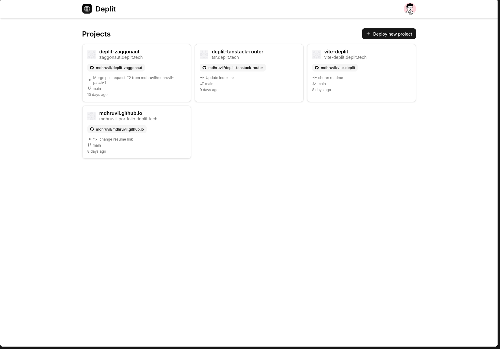
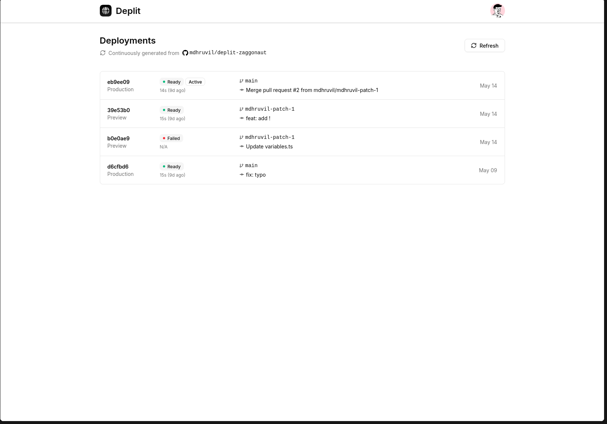
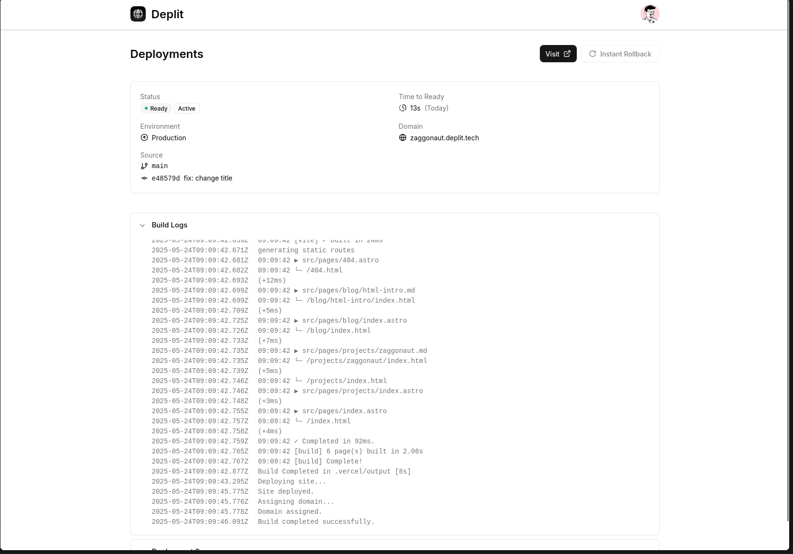

# Deplit

[](https://deepwiki.com/mdhruvil/deplit)

Deplit is my attempt to create Vercel from scratch. I have been using Vercel and Cloudflare Pages to host my sites. So one day I thought _How does this actually works ?_ Then I started to research about this topic and created this topic.

The blog [Behind the scenes of Vercel's infrastructure](https://vercel.com/blog/behind-the-scenes-of-vercels-infrastructure) was very helpful in understaing how vercel actually works under the hood.

Blog Post on Deplit's technical details: [https://mdhruvil.com/blog/deplit/](https://mdhruvil.com/blog/deplit/)

~~Live: [https://deplit.tech](https://deplit.tech)~~ Not live anymore, servers cost money :(

YouTube video showcasing deplit: [https://www.youtube.com/watch?v=a4w8_rXajl4](https://www.youtube.com/watch?v=a4w8_rXajl4)

## 🌟 Features

- ⚡ **Instant Rollback** - One-click rollback to previous deployments
- 📦 **Preview Deployments** - Preview your deployments before production.
- 🌐 **Global CDN** - Serve your site from nearest to your users
- 🚀 **Instant Automatic Deployments** - Push to GitHub, get instant deployments
- 🔗 **Subdomains** - Free `.deplit.tech` subdomains for all projects
- 🔒️ **Private Repo** - Deploy from your private repositories
- 📊 **Build Logs** - Real-time build monitoring and detailed logs
- 💻️ **Serverless Function** _(Soon)_ - Deploy your SSR or ISR apps to deplit

## But Why ?

The main motive behind creating Deplit was to understand how hosting platforms work. What happens when I push code to GitHub? How is it built? Where is it built? How is my site served? Why is it so fast? To know the answers to these questions, I began researching. That's when I came across this blog post: [Behind the scenes of Vercel's infrastructure](https://vercel.com/blog/behind-the-scenes-of-vercels-infrastructure) by [Lydia Hallie](https://x.com/lydiahallie). This blog post is bit outdated. Vercel's architecture has evolved a lot with the introduction to [Vercel’s builds infrastructure](https://vercel.com/blog/a-deep-dive-into-hive-vercels-builds-infrastructure) and [Fluid Compute](https://vercel.com/blog/introducing-fluid-compute). See [this](https://x.com/leerob/status/1898177290128994636) tweet/xeet by [leerob](https://x.com/leerob). However, the core concepts are still the same. So I started implementing these concepts in my own way, and that's how Deplit was born.

Well some people say Vercel is just a glorified AWS wrapper, but trust me it's more than that. With features like zero config deploys, instant rollbacks, preview deployments and more. Vercel handles a lot of complexity out of the box. And DX is far more better than AWS.

## What is Vercel?

If you have been living under a rock and don't know what Vercel is, here's what ChatGPT describes it:

> Vercel is a platform as a service (PaaS) designed to simplify the deployment of web projects. It offers a seamless CI/CD experience, allowing developers to easily deploy static websites, server-rendered applications, and APIs. With Vercel, developers can concentrate on building and improving their applications without having to manage the underlying infrastructure.

## How do Vercel/Deplit/Others works?

All these hosting platforms work somewhat similarly. Here I'll explain what happens when you deploy a site on Deplit.

## High-level overview

Here's a high-level overview:

1. You create a project on Deplit and connect your GitHub repository.
2. Deplit starts listening to your GitHub repository for any push events.
3. You push code to GitHub.
4. GitHub notifies Deplit about newly pushed commit.
5. Deplit creates a new deployment and adds it to a build queue.
6. The builder is spawned. It picks up the deployment and starts the build process.
7. The builder clones the repository, installs dependencies, builds the project and uploads the build artifacts to a storage bucket.
8. After successful build, the builder notifies Deplit about the successful build.
9. Deplit updates the deployment status and serves the site from this new deployment.

From overview, you can tell there are two main components involved in this process: the builder and the CDN/proxy. Let's dive deeper into each of them.

## Builder


When you create a project on Deplit and connect your GitHub repository, Deplit starts listening for push events using GitHub App webhooks. Every time you push code to GitHub, GitHub notifies Deplit about the new commit via these webhooks.

Deplit then creates a new deployment for all projects connected to that repository and adds it to the Azure Build Storage Queue, which triggers the Spawner, an Azure Function configured with a Queue Trigger.

Spawner then spawns a new Azure Container Apps Job which has two containers:

1. **Build Container**: Responsible for building the project.
2. **Sidecar Container**: Handles communication with the Deplit API and uploads build artifacts to the storage bucket.

Now, you might be wondering: _Why not use a single container for both tasks?_
The reason is isolation. The container running the build process should be completely isolated from Deplit's system to prevent user code from accessing sensitive APIs or internal infrastructure. That’s why all interactions with Deplit’s API and the uploading of build artifacts are handled exclusively by the sidecar container. Communication between the two containers is authenticated using a shared secret so the build process can't communicate with the sidecar container. And of course, the build process doesn't have access to this shared secret.

Both [Harkirat's](https://youtu.be/c8_tafixiAs), [Piyush Garg's](https://youtu.be/0A_JpLYG7hM?si=6QtvDF6EDOyDBZ04) implementations have this critical vulnerability, where the build process directly has access to sensitive secrets.

After successful build, the sidecar container uploads the build artifacts to the storage bucket and notifies Deplit about the successful build.

The artifacts are stored in Azure Blob Storage under the `<project-id>/<commit-hash>/` directory, so multiple deployments of the same project can coexist without conflicts.

## Why Deplit is fast?


This is the most important and interesting part of Deplit. At the heart of its speed is **the proxy**, which is responsible for serving the site from the nearest edge location to the user.

This proxy is implemented using a Cloudflare Worker with a custom route pattern: `*.deplit.tech/*`. It handles all requests to Deplit subdomains and routes them to the correct deployment.

When a request comes in,

1. The proxy checks about the site:deployment metadata in the Cloudflare KV store for that subdomain.
2. If it doesn't exists, it returns a 404 page.
3. If it does exist, it looks something like this:

```json
{
  "projectId": "f8b9e082-83b3-45df-8b76-c1fe00a9e969",
  "commitHash": "c14f5edc9205f6f780b8321374ad513fdb97263a",
  "spa": true,
  "htmlRoutes": {
    "/": "index.html"
    // more routes
  }
}
```

4. The proxy then constructs the URL for the requested resource based on the metadata.
5. This URL is used as a cache key for the Cloudflare cache.

> Deplit doesn’t use Cloudflare CDN directly, but it leverages the same underlying caching layer used by Cloudflare’s CDN.

6. If the resource is already cached, it is served instantly.
7. If not, the proxy fetches it from Azure Blob Storage using a URL like:
   `https://<deplit-blob-id>.blob.core.windows.net/<project-id>/<commit-hash>/<resource-path>`
8. Once fetched, it is cached for subsequent requests, delivering blazing-fast performance.

## How fast is Deplit?

How fast are deployments on Deplit and Vercel ? I did a quick benchmark to check which is faster ?

Conditions:

- Same project deployed on both. I have used [https://github.com/mdhruvil/deplit-next](https://github.com/mdhruvil/deplit-next) for testing.
- Browser cache disabled in DevTools
- CDN cache: HIT. Both Deplit and Vercel uses CDN to serve files. This benchmark assumes that the files are cached at CDN.

Here are results for average load time for all the requests:

🚀 Deplit: ~93.38 ms<br/>
🚀 Vercel: ~79.47 ms

Deplit is ~13ms slower than Vercel. While Vercel is technically faster, Deplit’s sub-100ms average load time is still very impressive, especially considering it's built by a student!

See my linkedin post for images and more information: [linkedin post](https://www.linkedin.com/posts/mdhruvil_deplit-vercel-which-is-faster-how-activity-7332808898275442688-SK5a)

## Far more to go

Even though I have built something that can deploy static sites, Deplit is nowhere near Vercel. But Deplit's current architecture makes it easy to add new features like:

1. **Serverless Functions/Edge Functions**:
   - Deplit uses `vercel` CLI to build projects which outputs artifacts compatible with Vercel's [Build Output API v3](https://vercel.com/docs/build-output-api).
   - This means that Deplit can support serverless functions, edge functions and SSR/ISR apps with minimal changes.
   - All I need to do is implement a custom router that understands the Vercel's Build Output API v3.
2. **Web Analytics**:
   - Since the proxy worker is invoked for every request, I can plug some custom logic to track page views and other analytics data.
3. **Image Optimization**:
   - Using the same proxy worker, Deplit can offer on-the-fly image optimization via Cloudflare Image, similar to Vercel’s image optimization feature.
4. **...and many more**:
   - The foundation is set. With a flexible proxy and clear build output standards, Deplit is ready to grow.

## Conclusion

Building Deplit has been one of the most fun and challenging projects I've ever worked on. It has given me an understanding of how hosting platforms work and the complexities involved in building such systems.

If you have any questions or feedback feel free to reach out to me on any of the platforms below. I'd love to chat about this project or anything else you're working on.

- `hey@mdhruvil.com`
- [LinkedIn](https://www.linkedin.com/in/mdhruvil/)
- [X](https://x.com/mdhruvill)

Peace out! ✌️

## 📦️ Project Structure

```bash
.
├── apps
│   ├── api                # main backend api
│   ├── builder            # container image for building user code
│   ├── controlplane       # dashboard
│   ├── proxy              # cf worker that works as proxy for *.deplit.tech/*
│   └── sidecar            # Secure proxy for builder communication
├── bruno
├── LICENSE
├── package.json
├── packages               # shared packages
│   ├── eslint-config
│   ├── typescript-config
│   └── ui
├── pnpm-lock.yaml
├── pnpm-workspace.yaml
├── README.md
└── turbo.json
```

## 🏗️ Infrastructure

- Cloudflare Workers (proxy, api)
- Cloudflare Cache layer (proxy)
- Cloudflare D1 (database)
- Cloudflare KV (kv store for metadata)
- Azure Container App Jobs (build container and sidecar)
- Azure Blob Storage (for storing build assets)
- GitHub Packages (for publishing builder, sidecar images)

## 💻️ Local Setup

TODO

## 🧑‍💻 Contributing

TODO

## 📄 License

[MIT](./LICENSE)

## 📸 Screenshots




